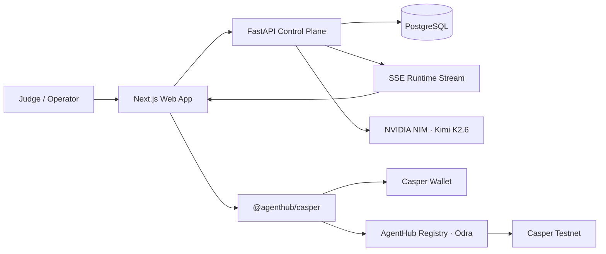
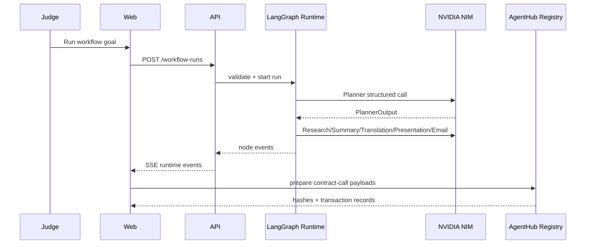
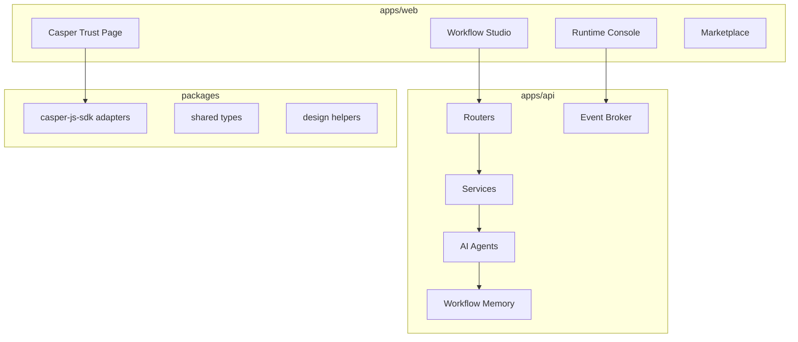
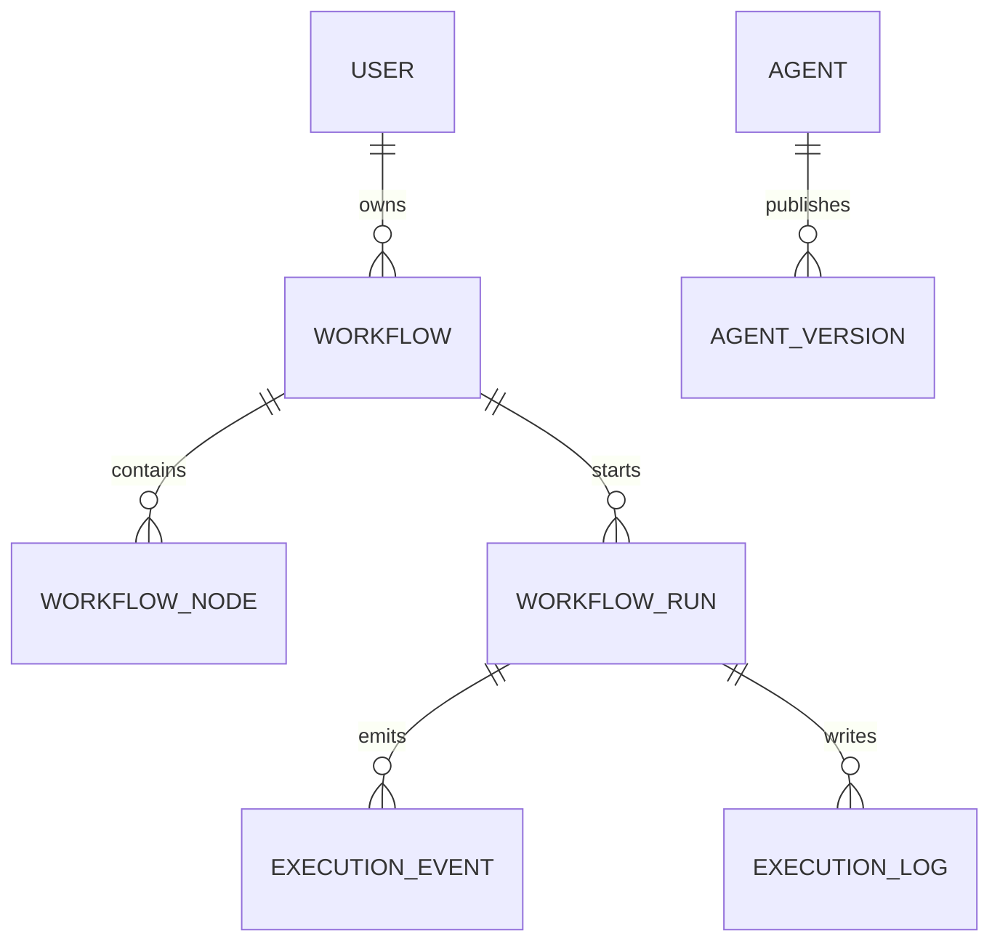
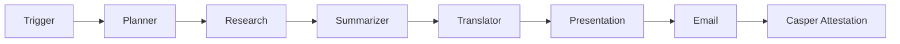
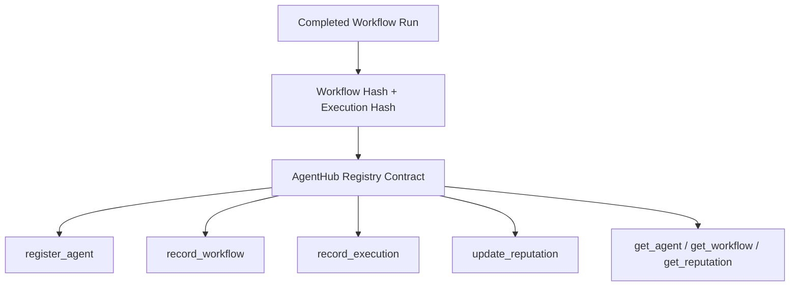

# AgentHub diagrams

## Architecture diagram

```mermaid
flowchart LR
  User["Judge / Operator"] --> Web["Next.js Web App"]
  Web --> API["FastAPI Control Plane"]
  API --> DB[("PostgreSQL")]
  API --> SSE["SSE Runtime Stream"]
  API --> NVIDIA["NVIDIA NIM · Kimi K2.6"]
  Web --> CasperPkg["@agenthub/casper"]
  CasperPkg --> Wallet["Casper Wallet"]
  CasperPkg --> Contract["AgentHub Registry · Odra"]
  Contract --> Testnet["Casper Testnet"]
  SSE --> Web
```

## Runtime sequence

```mermaid
sequenceDiagram
  participant Judge
  participant Web
  participant API
  participant Graph as LangGraph Runtime
  participant NIM as NVIDIA NIM
  participant Casper as AgentHub Registry

  Judge->>Web: Run workflow goal
  Web->>API: POST /workflow-runs
  API->>Graph: validate + start run
  Graph->>NIM: Planner structured call
  NIM-->>Graph: PlannerOutput
  Graph->>NIM: Research/Summary/Translation/Presentation/Email
  Graph-->>API: node events
  API-->>Web: SSE runtime events
  Web->>Casper: prepare contract-call payloads
  Casper-->>Web: hashes + transaction records
```

## Component diagram

```mermaid
flowchart TB
  subgraph Web["apps/web"]
    Studio["Workflow Studio"]
    Runtime["Runtime Console"]
    CasperPage["Casper Trust Page"]
    Marketplace["Marketplace"]
  end

  subgraph API["apps/api"]
    Routers["Routers"]
    Services["Services"]
    Agents["AI Agents"]
    Memory["Workflow Memory"]
    Events["Event Broker"]
  end

  subgraph Packages["packages"]
    Casper["casper-js-sdk adapters"]
    Types["shared types"]
    UI["design helpers"]
  end

  Studio --> Routers
  Runtime --> Events
  CasperPage --> Casper
  Routers --> Services
  Services --> Agents
  Agents --> Memory
```

## Database diagram

```mermaid
erDiagram
  WORKFLOW ||--o{ WORKFLOW_NODE : contains
  WORKFLOW ||--o{ WORKFLOW_RUN : starts
  WORKFLOW_RUN ||--o{ EXECUTION_EVENT : emits
  WORKFLOW_RUN ||--o{ EXECUTION_LOG : writes
  AGENT ||--o{ AGENT_VERSION : publishes
  USER ||--o{ WORKFLOW : owns
```

## Workflow diagram

```mermaid
flowchart LR
  Trigger --> Planner
  Planner --> Research
  Research --> Summarizer
  Summarizer --> Translator
  Translator --> Presentation
  Presentation --> Email
  Email --> Casper["Casper Attestation"]
```

## Casper integration diagram

```mermaid
flowchart TB
  Run["Completed Workflow Run"] --> Hashes["Workflow Hash + Execution Hash"]
  Hashes --> Registry["AgentHub Registry Contract"]
  Registry --> A["register_agent"]
  Registry --> W["record_workflow"]
  Registry --> E["record_execution"]
  Registry --> R["update_reputation"]
  Registry --> Query["get_agent / get_workflow / get_reputation"]
```
